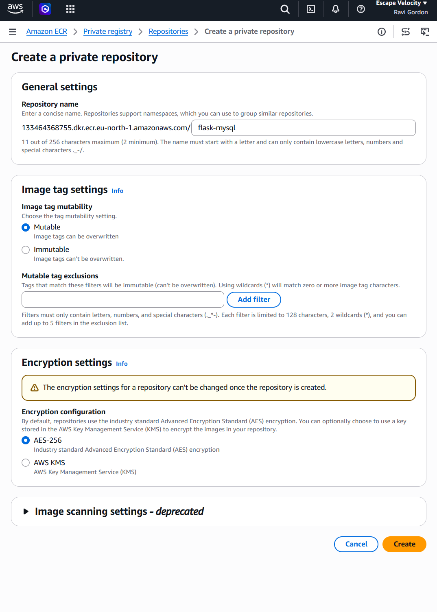
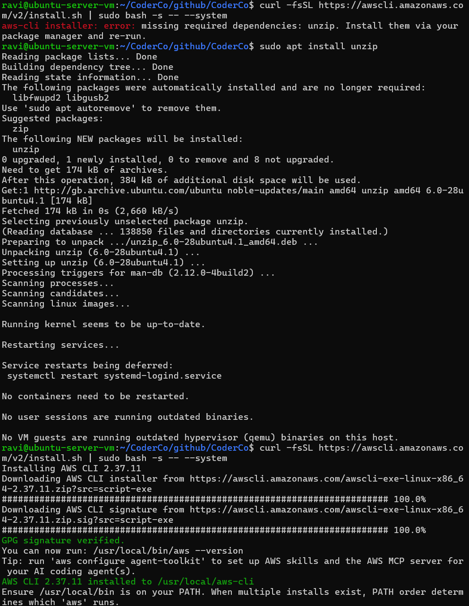
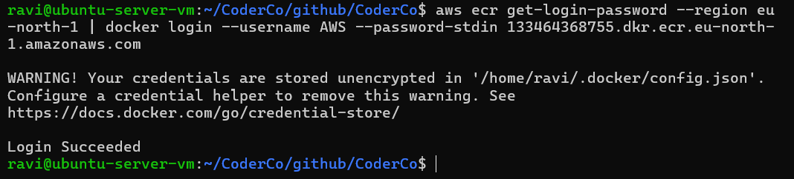
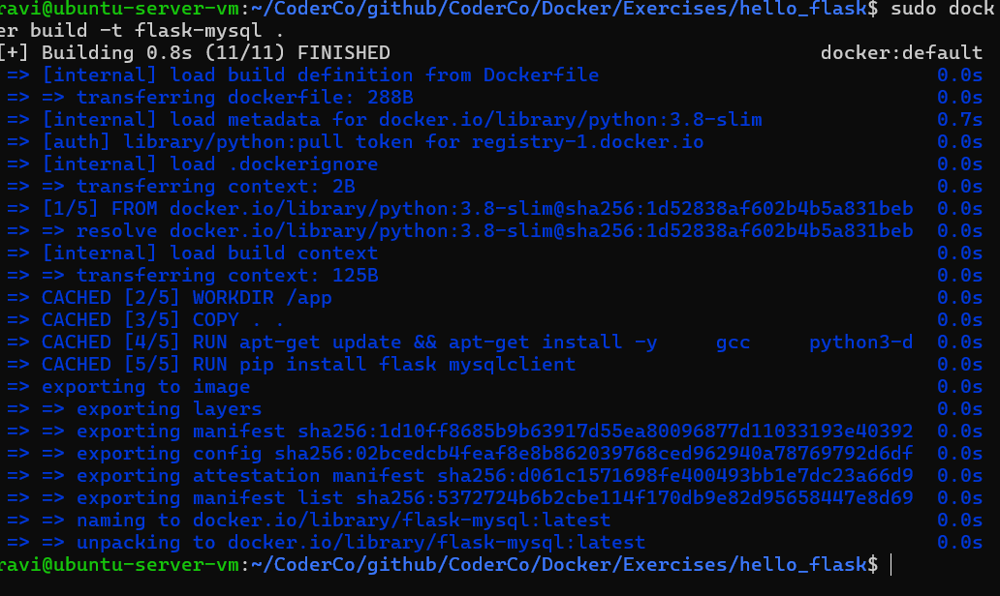
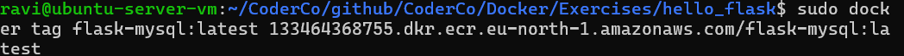
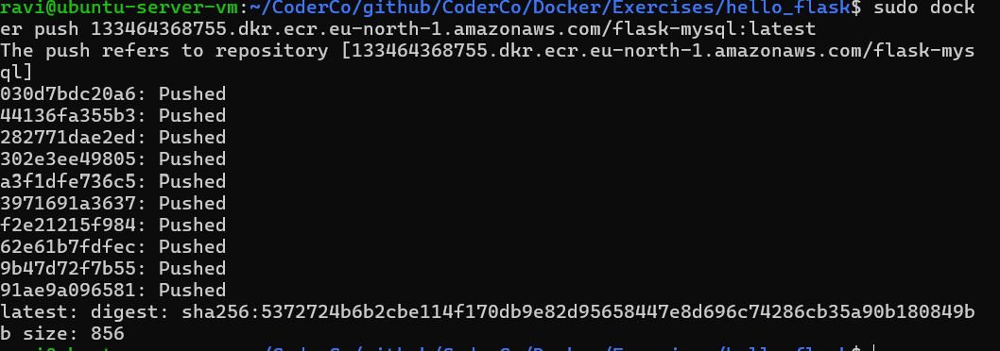

# Amazon ECR – Pushing My First Docker Image to AWS

## Overview

As part of my CoderCo Docker module, I practised publishing a Docker image to Amazon Elastic Container Registry (ECR).

Having previously published my Flask application to Docker Hub, I wanted to understand how the same workflow could be implemented using AWS.

For this exercise, I used my existing Flask and MySQL application, running on an Ubuntu Server VM hosted in Proxmox.

The objective was to create a private ECR repository, configure AWS CLI authentication, build and tag a Docker image, and push it to AWS.

## 1. Creating a Private Repository in Amazon ECR

I started by navigating to Amazon ECR in the AWS Management Console.

I created a private repository named:

`flask-mysql`

I selected the Europe (Stockholm) region, `eu-north-1`.

This repository would store the Docker image for my Flask application.



## 2. Installing the AWS CLI on Ubuntu

Next, I needed to install the AWS CLI on my Ubuntu Server VM so I could interact with AWS from the terminal.

During installation, I encountered an error because the `unzip` utility was not installed.

I resolved this by installing it:

```bash
sudo apt update
sudo apt install unzip
```

I then continued with the AWS CLI installation using:

```bash
curl -fsSL https://awscli.amazonaws.com/v2/install.sh | sudo bash -s -- --system
```

After installation, I could verify the AWS CLI using:

```bash
aws --version
```



## 3. Authenticating AWS CLI and Docker with Amazon ECR

Before pushing an image, I needed to authenticate my Ubuntu VM with AWS.

Initially, I encountered the following error:

```text
NoCredentials: Unable to locate credentials
```

This occurred because my AWS CLI had not been authenticated.

I resolved the issue using browser-based authentication:

```bash
aws login --region eu-north-1 --remote
```

The `--remote` option was particularly useful because I was accessing my Ubuntu Server VM through SSH.

After successfully authenticating, I could verify my AWS identity using:

```bash
aws sts get-caller-identity
```

I then authenticated my Docker client with Amazon ECR:

```bash
aws ecr get-login-password --region eu-north-1 | sudo docker login --username AWS --password-stdin 133464368755.dkr.ecr.eu-north-1.amazonaws.com
```

This returned:

```text
Login Succeeded
```

I also learnt that AWS CLI authentication and Docker registry authentication are separate steps.



## 4. Building My Docker Image

I navigated to my existing `hello_flask` application directory, which contained my Dockerfile.

I built the image using:

```bash
sudo docker build -t flask-mysql .
```

**Command breakdown:**

- `docker build` – Builds a Docker image from a Dockerfile.
- `-t` – Assigns a name and tag to the image.
- `flask-mysql` – Name of the Docker image.
- `.` – Uses the current directory as the build context.

Docker successfully built the image, which I could then prepare for Amazon ECR.



## 5. Tagging My Docker Image for Amazon ECR

Before pushing the image, I needed to tag it with the correct ECR repository URI.

I used:

```bash
sudo docker tag flask-mysql:latest 133464368755.dkr.ecr.eu-north-1.amazonaws.com/flask-mysql:latest
```

**Command breakdown:**

- `docker tag` – Creates another reference to an existing Docker image.
- `flask-mysql:latest` – My locally built image.
- `133464368755.dkr.ecr.eu-north-1.amazonaws.com` – My AWS ECR registry endpoint.
- `/flask-mysql:latest` – Repository name and image tag.

Tagging the image allows Docker to identify the correct destination registry and repository when pushing.



## 6. Pushing My Image to Amazon ECR

Once the image was built, tagged and authenticated, I pushed it to my private ECR repository.

```bash
sudo docker push 133464368755.dkr.ecr.eu-north-1.amazonaws.com/flask-mysql:latest
```

This command uploads the required Docker image layers to the Amazon ECR repository.

The image can then be retrieved by authorised users and AWS services.



## 7. Verifying My Image in Amazon ECR

To verify the image, I can navigate to my `flask-mysql` repository in the AWS Management Console and check the image tags.

I can also verify it using the AWS CLI:

```bash
aws ecr list-images \
  --repository-name flask-mysql \
  --region eu-north-1
```

The expected result is an image with the `latest` tag.

## What I Learnt

This exercise helped me understand how Docker integrates with AWS container registries.

My main takeaways were:

- **Amazon ECR:** AWS provides a managed container registry for storing and distributing Docker images.
- **Private repositories:** ECR can store application images with access controlled through AWS IAM.
- **AWS CLI:** I learnt how to authenticate my Ubuntu VM with AWS and interact with AWS services through the terminal.
- **Docker authentication:** AWS CLI authentication and Docker registry authentication are separate processes.
- **Image tagging:** Docker images must be tagged with the correct registry endpoint and repository name before being pushed.
- **Troubleshooting:** I resolved missing dependencies, AWS authentication errors, remote browser authentication issues and Docker permission errors.
- **Deployment consistency:** Images stored in ECR can be retrieved by authorised systems, helping standardise application deployment.

Having previously worked with Docker Hub, I now understand how similar image-management workflows can be used with both public and private container registries.

I can see how Amazon ECR fits into a wider DevOps workflow, particularly when deploying containerised applications to AWS services such as ECS and EKS.

## Next Steps

As I progress through CoderCo, I want to build on this exercise by:

- Practising pulling Docker images from Amazon ECR.
- Learning how AWS IAM permissions control access to private container registries.
- Automating Docker image builds and pushes using CI/CD pipelines.
- Exploring how ECR integrates with AWS ECS and EKS.

This will help me progress from manually managing Docker images towards automated cloud deployments.
