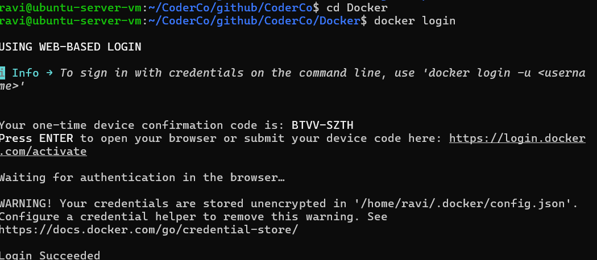
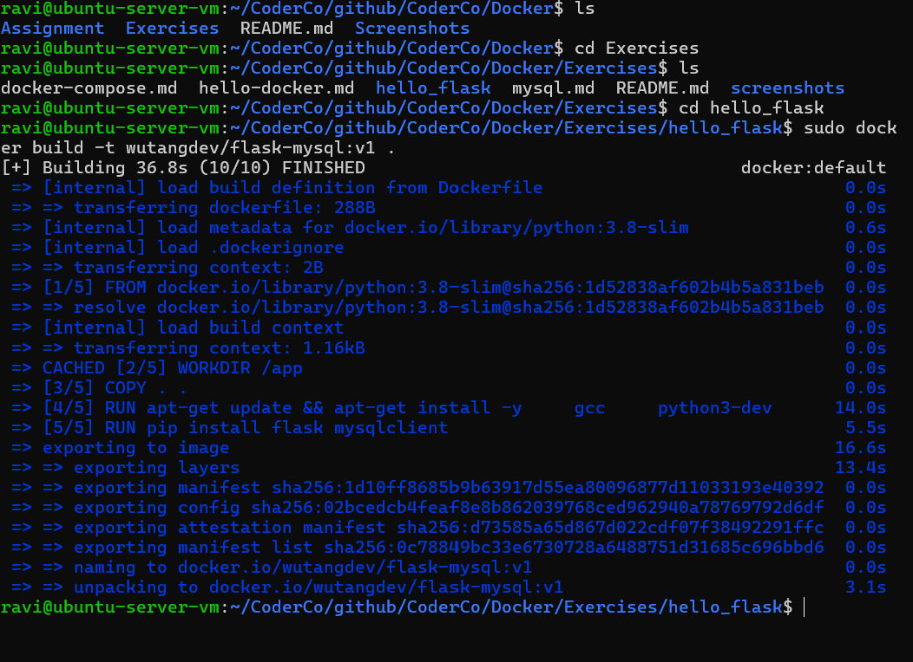
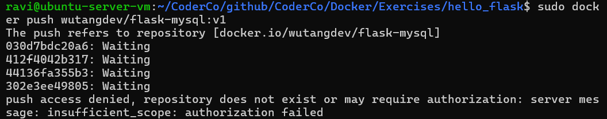
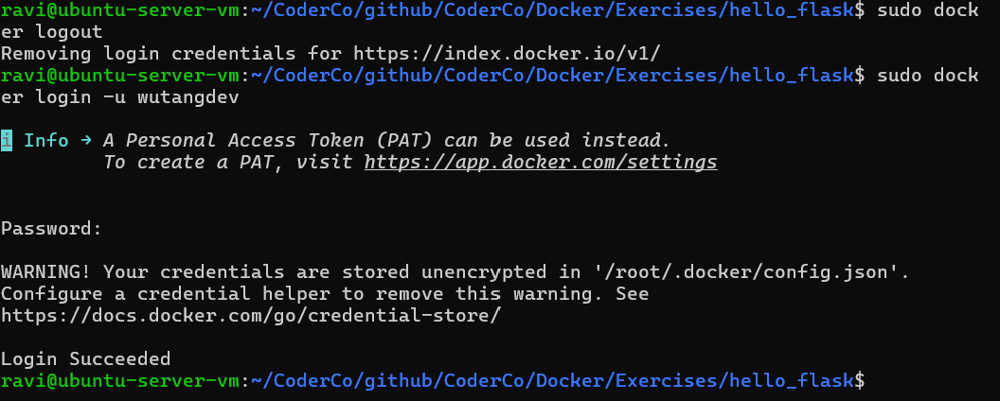
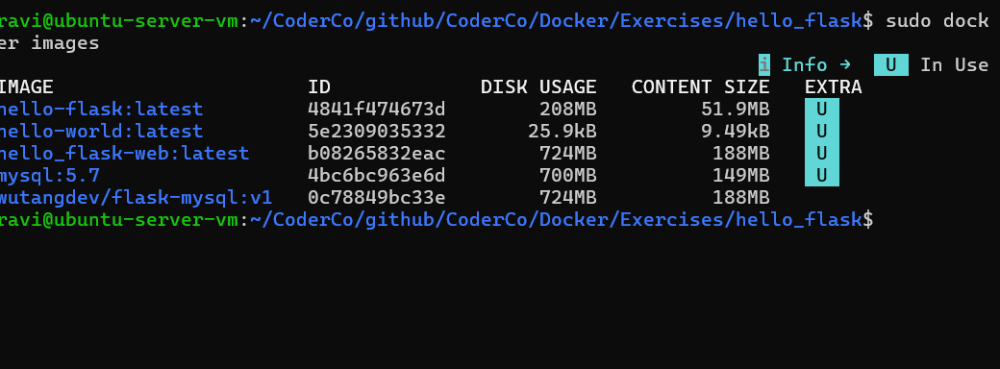
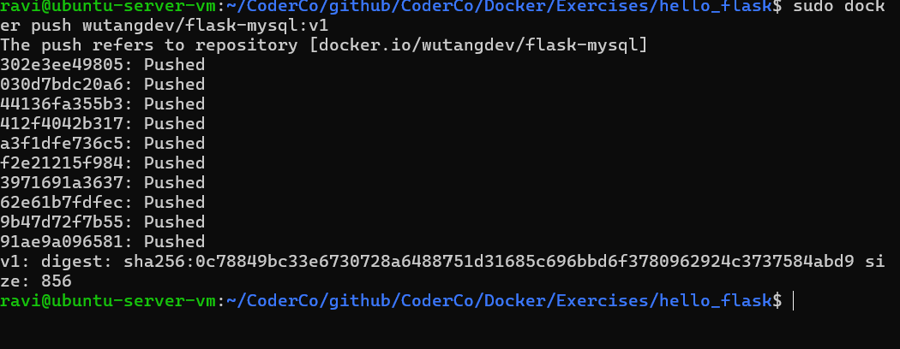
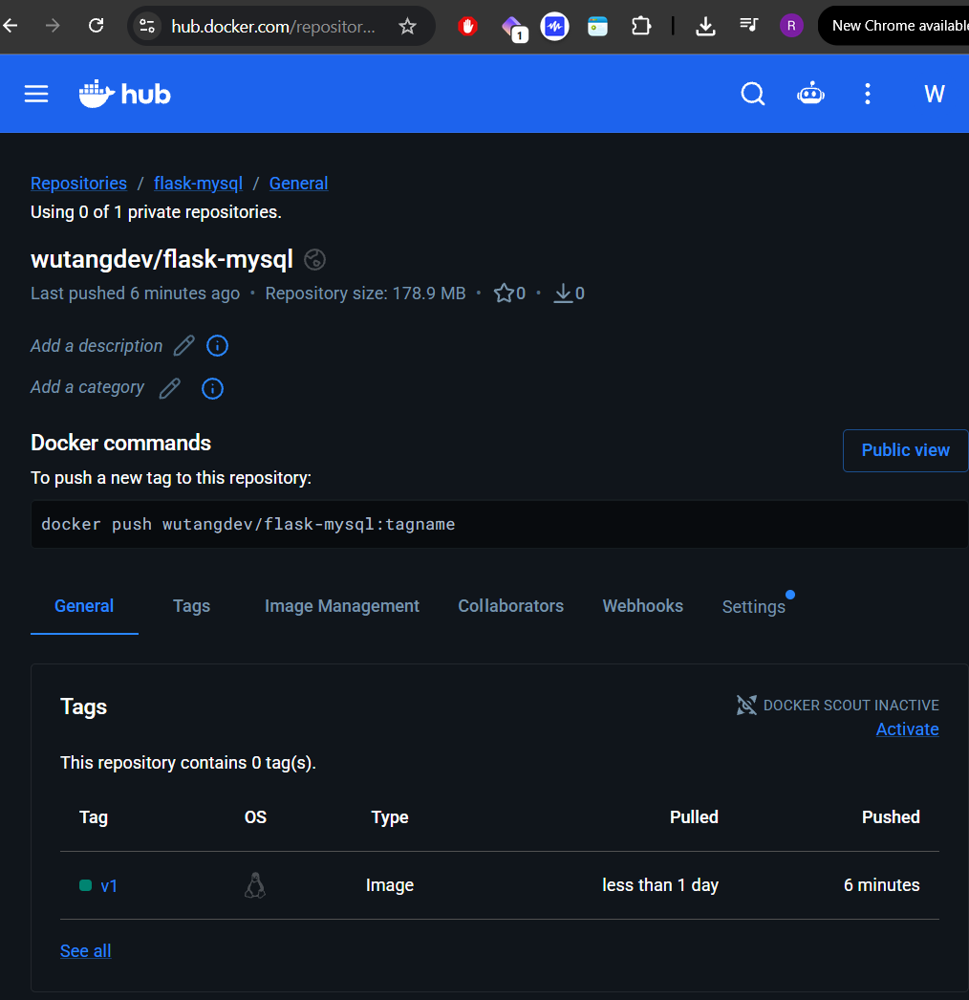

# Docker Hub – Publishing My First Docker Image

## Overview

As part of my CoderCo Docker module, I practised integrating Docker Hub into my workflow by building, tagging, pushing and pulling a Docker image.

For this exercise, I used my existing Flask application running on an Ubuntu Server VM hosted in Proxmox.

The goal was to understand how Docker Hub acts as a container registry and how images can be shared and reused across different environments.

## 1. Logging into Docker Hub

I started by logging into my Docker Hub account from my Ubuntu Server VM using the terminal.

```bash
sudo docker login -u wutangdev
```



## 2. Building My Docker Image

I navigated to my `hello_flask` project directory, which contained my Dockerfile.

I built the image using:

```bash
sudo docker build -t wutangdev/flask-mysql:v1 .
```

**Command breakdown:**

- `docker build` – Builds an image from a Dockerfile.
- `-t` – Assigns a name and tag to the image.
- `wutangdev/flask-mysql` – Docker Hub repository name.
- `v1` – Image version tag.
- `.` – Uses the current directory as the build context.



## 3. Pushing the Image to Docker Hub

I attempted to push the image to Docker Hub but encountered errors during the process.

One error was:

```text
The push refers to repository [docker.io/wutangdev/flask-mysql]
tag does not exist: wutangdev/flask-mysql:latest
```

This occurred because Docker was looking for the `latest` tag, whereas I had built my image using the `v1` tag.

I also encountered an authentication error:

```text
push access denied, repository does not exist or may require authorization
insufficient_scope: authorization failed
```

This indicated that Docker Hub was rejecting the push due to insufficient authorization.



## 4. Troubleshooting Docker Hub Authentication

To resolve the authentication issue, I generated a Personal Access Token (PAT) through my Docker Hub account.

I then logged out of Docker Hub:

```bash
sudo docker logout
```

I logged back in using:

```bash
sudo docker login -u wutangdev
```

When prompted for my password, I entered my Personal Access Token instead.

This successfully authenticated my Ubuntu Server VM with Docker Hub.

**Security lesson:** Personal Access Tokens allow access to be managed and revoked independently of the account password. Tokens should never be committed to GitHub or included in screenshots.



## 5. Verifying My Docker Images

Before attempting another push, I checked my locally available Docker images.

```bash
sudo docker images
```

This allowed me to confirm that the image had been created with the correct repository name and version tag:

```text
wutangdev/flask-mysql:v1
```

I also learnt that Docker prevents the normal removal of images still referenced by existing containers.

Rather than forcing their removal, I decided to keep those images to avoid disrupting my existing Docker labs.



## 6. Successfully Pushing My Image

After resolving the authentication issue and confirming the correct tag, I pushed the image using:

```bash
sudo docker push wutangdev/flask-mysql:v1
```

The push completed successfully, uploading the required image layers to Docker Hub.



## 7. Verifying the Image on Docker Hub

I logged into Docker Hub through my browser and navigated to my repository.

I confirmed that my image had been published with the `v1` tag.

**Docker Hub Repository:**

https://hub.docker.com/r/wutangdev/flask-mysql



## 8. Testing Docker Pull

Finally, I tested retrieving the image from Docker Hub using:

```bash
sudo docker pull wutangdev/flask-mysql:v1
```

This allowed me to verify that the published image could be retrieved from the registry.

Since the image already existed locally, Docker could reuse existing layers rather than downloading everything again.

## What I Learnt

This exercise helped me understand how Docker Hub fits into a containerised application workflow.

My main takeaways were:

- **Image management:** Docker images can be built locally, tagged and published to a central registry.
- **Versioning:** Tags such as `v1` allow different versions of an application image to be identified.
- **Authentication:** Personal Access Tokens provide a secure way to authenticate Docker CLI operations.
- **Troubleshooting:** I practised resolving image-tagging errors, authentication failures and image deletion conflicts.
- **Consistency:** Developers can pull the same application image rather than manually recreating the application environment.
- **Deployment:** Container registries make it easier to distribute application images between development, testing and production environments.

I can see how useful Docker Hub would be when joining a development team. Instead of spending time rebuilding an application from scratch, a developer can pull an existing image and use the required configuration to get the application running.

I also now understand how container registries support DevOps workflows, particularly CI/CD pipelines, where application images can be built, tested, published and deployed automatically.

## Next Steps

As I continue through CoderCo, I want to build on this by learning how to automate image builds and pushes using CI/CD pipelines.

This will help me move from manually managing Docker images towards a more automated deployment workflow.