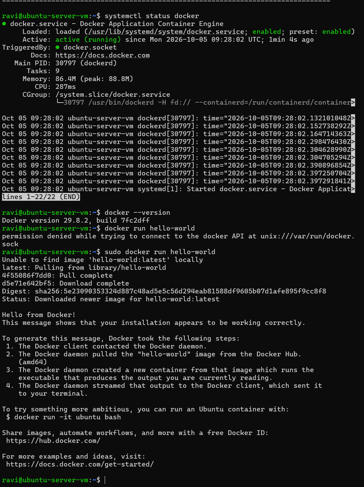

# Hello Docker

## Objective

Install Docker Engine on my Ubuntu Server VM, verify that the Docker service is running and successfully deploy my first container using the `hello-world` image.

## Environment

- Ubuntu Server VM
- Proxmox homelab
- Docker Engine
- Linux CLI

## Docker Installation

I downloaded the official Docker installation script:

```bash
curl -fsSL https://get.docker.com -o get-docker.sh
```

Before installing Docker, I performed a dry run:

```bash
sudo sh get-docker.sh --dry-run
```

I then installed Docker:

```bash
sudo sh get-docker.sh
```

## Verify Docker Service

After installation, I checked the Docker service:

```bash
systemctl status docker
```

The service returned:

```text
Active: active (running)
```

This confirmed that the Docker daemon had successfully started.

## Verify Docker Version

I checked the installed Docker version:

```bash
docker --version
```

Docker returned:

```text
Docker version 29.8.2
```

## Running My First Container

I initially attempted to run:

```bash
docker run hello-world
```

This returned a permission error when attempting to communicate with the Docker daemon:

```text
permission denied while trying to connect to the docker API at unix:///var/run/docker.sock
```

## Troubleshooting

The Docker service itself was running correctly.

The issue occurred because my standard Linux user did not currently have permission to communicate with the Docker daemon through the Docker socket.

I therefore tested the command with elevated privileges:

```bash
sudo docker run hello-world
```

Docker then successfully:

1. Checked for the `hello-world` image locally
2. Determined that the image was not available locally
3. Pulled the image from Docker Hub
4. Created a container from the image
5. Started the container
6. Displayed the output from the container

The result was:

```text
Hello from Docker!
This message shows that your installation appears to be working correctly.
```

## What I Learned

This exercise helped reinforce several Docker concepts:

- Docker uses a client-server architecture
- The Docker CLI communicates with the Docker daemon
- Docker images can be downloaded from Docker Hub
- Containers are created from images
- Images and containers are not the same thing
- Linux permissions can prevent a user from accessing the Docker daemon
- `sudo` can be used to run Docker commands with elevated privileges
- `systemctl` can be used to verify the Docker service

The workflow for my first container was:

```text
docker run hello-world
        |
        v
Docker CLI
        |
        v
Docker daemon
        |
        v
Check for image locally
        |
        v
Pull hello-world from Docker Hub
        |
        v
Create container from image
        |
        v
Run container
        |
        v
Hello from Docker!
```

## Screenshot Evidence

The screenshot below shows the verification of my Docker installation and the process of running my first container.



### What the Screenshot Demonstrates

I first verified that the Docker service was running:

```bash
systemctl status docker
```

The service returned:

```text
Active: active (running)
```

I then checked the installed Docker version:

```bash
docker --version
```

This confirmed that Docker Engine had been successfully installed.

Next, I attempted to run my first container:

```bash
docker run hello-world
```

This returned:

```text
permission denied while trying to connect to the docker API at unix:///var/run/docker.sock
```

This showed that Docker itself was running, but my standard user did not currently have permission to communicate with the Docker daemon through the Docker socket.

I retried the command with elevated privileges:

```bash
sudo docker run hello-world
```

Docker could not initially find the `hello-world:latest` image locally, so it automatically pulled the image from Docker Hub.

The image was downloaded successfully and Docker created and ran a container from it.

The final output:

```text
Hello from Docker!
This message shows that your installation appears to be working correctly.
```

confirmed that my Docker installation was functioning successfully.

### Troubleshooting Summary

```text
docker run hello-world
        |
        v
Permission denied accessing Docker socket
        |
        v
sudo docker run hello-world
        |
        v
hello-world image not available locally
        |
        v
Docker pulls image from Docker Hub
        |
        v
Container created from image
        |
        v
Container executed
        |
        v
Hello from Docker!
```

### Key Takeaway

This exercise demonstrated that successfully installing Docker involves more than checking whether the package exists.

I verified the Docker daemon was running, confirmed the installed version, encountered a Linux permissions issue when communicating with the Docker socket, and successfully ran the container with elevated privileges.

It also demonstrated the basic Docker workflow:

**Docker CLI → Docker daemon → image → container → application output**

## Next Steps

- Explore `docker ps` and `docker ps -a`
- Inspect downloaded Docker images
- Practise starting and removing containers
- Learn more about Docker permissions
- Begin building a custom Docker image