# Linking Docker Containers – Flask and MySQL

## Overview

As part of my CoderCo Docker module, I extended my existing Hello Flask application by introducing a MySQL database running in a separate Docker container.

The objective was to understand how Docker containers communicate using custom networks, how to install additional application dependencies, and how to troubleshoot Docker build errors.

This exercise involved:

- Updating my Flask application to connect to MySQL.
- Installing the `mysqlclient` Python package.
- Creating a custom Docker network.
- Running a MySQL container.
- Updating and rebuilding my Flask Docker image.
- Troubleshooting Docker commands, working directories and dependency installation errors.

## 1. Updating the Flask Application

I started by modifying my existing `app.py` to establish a connection to a MySQL database.

The application uses `MySQLdb`, provided by the `mysqlclient` Python package, to connect to MySQL and retrieve the database version.

```python
from flask import Flask
import MySQLdb

app = Flask(__name__)

@app.route('/')
def hello_world():
    # Connect to the MySQL database
    db = MySQLdb.connect(
        host="mydb",
        user="root",
        passwd="my-secret-pw",
        db="mysql"
    )

    cur = db.cursor()
    cur.execute("SELECT VERSION()")
    version = cur.fetchone()

    cur.close()
    db.close()

    return f"Hello, World! MySQL version: {version[0]}"

if __name__ == '__main__':
    app.run(host='0.0.0.0', port=5000)
```

The `host="mydb"` parameter refers to the MySQL container name, which Docker can resolve when both containers are connected to the same user-defined network.

The `SELECT VERSION()` query retrieves the MySQL server version.

For this learning exercise, I used a hardcoded database password. In a production environment, credentials should be supplied securely rather than committed to GitHub.

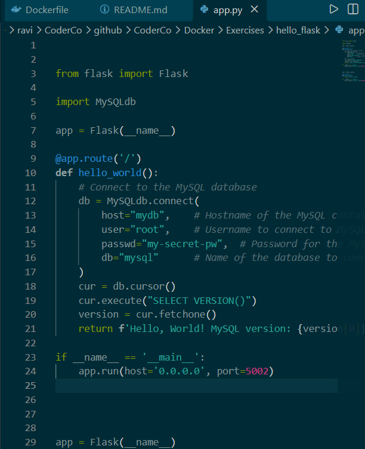

## 2. Updating the Dockerfile

My existing Dockerfile was designed to run a simple Flask application.

To support MySQL connectivity, I needed to install the `mysqlclient` package and its required Linux dependencies.

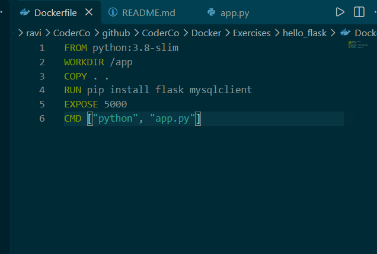

## 3. Creating a Custom Docker Network

Docker containers can communicate with one another using a user-defined bridge network.

I created a custom network to allow the Flask application and MySQL database to communicate.

```bash
sudo docker network create my-custom-network
```

This network provides container-name DNS resolution, allowing Flask to connect to the database using `mydb` instead of a manually configured IP address.

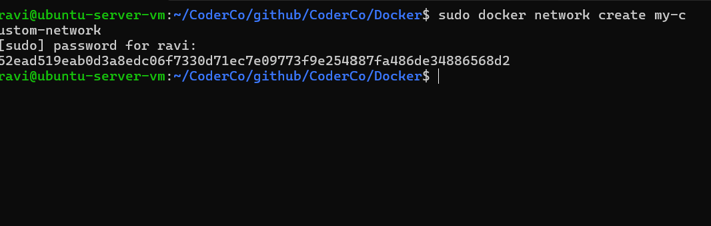

## 4. Running the MySQL Container

I attempted to start a MySQL container and connect it to my custom Docker network.

My initial command was incorrect:

```bash
docker run -d --name mydb --my-custom-network -e MYSQL_ROOT_PASSWORD=my-secret-pw mysql:5.7
```

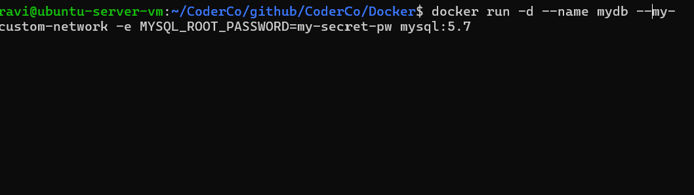

### Error – Unknown Flag

Docker returned:

```text
unknown flag: --my-custom-network

Usage: docker run [OPTIONS] IMAGE [COMMAND] [ARG...]
```

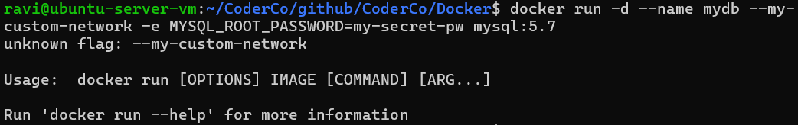

### Resolution

I realised that I had incorrectly specified the network name as a Docker flag.

The correct syntax uses `--network` followed by the existing network name.

```bash
sudo docker run -d \
  --name mydb \
  --network my-custom-network \
  -e MYSQL_ROOT_PASSWORD=my-secret-pw \
  mysql:5.7
```

I also used `sudo` because my Ubuntu environment requires elevated permissions to access the Docker daemon.

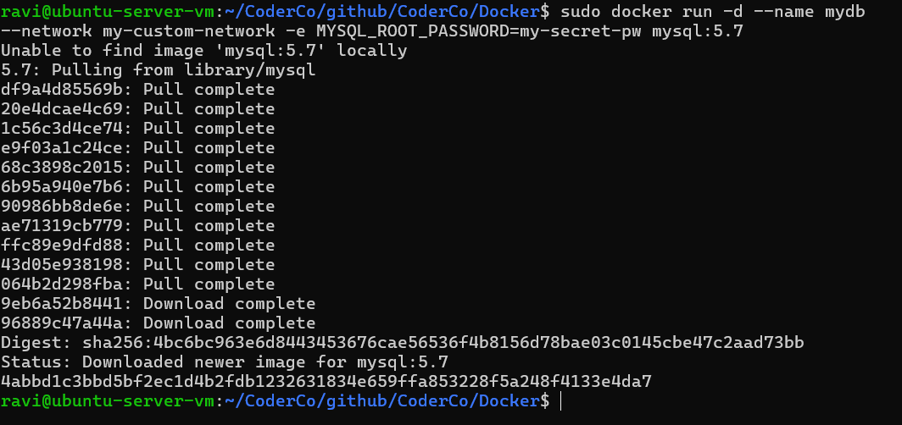

**Lesson learned:** Docker requires the correct command-line options. The `--network` flag connects a container to an existing network; it does not create the network.

## 5. Building the Updated Flask Image

After updating the application, I attempted to build the new Docker image.

```bash
sudo docker build -t hello-flask-mysql .
```

However, I encountered build errors.

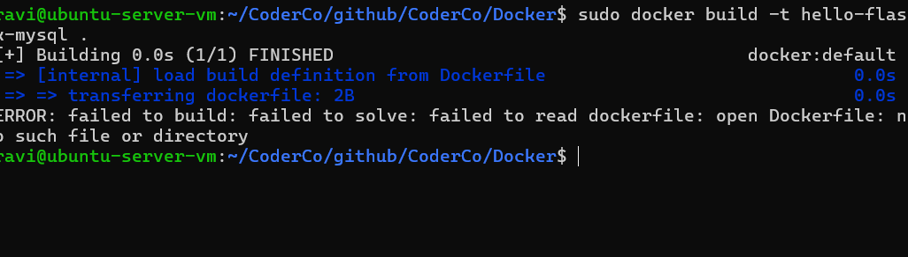

I initially attempted to resolve the issue by adding the following instructions to my Dockerfile:

```dockerfile
RUN pip install flask mysqlclient

EXPOSE 5000

RUN apt-get update && apt-get install -y \
    gcc \
    python3-dev \
    libmariadb-dev \
    pkg-config

RUN pip install flask mysqlclient

EXPOSE 5000
```


This introduced duplicate installation instructions and attempted to install `mysqlclient` before installing its required system dependencies.

## 6. Investigating the Flask Port Configuration

During troubleshooting, I noticed that my Flask application was configured to listen on port `5002`.

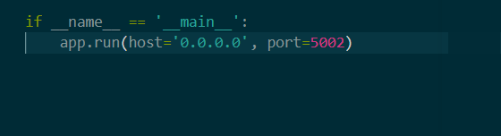

I changed the application to listen on port `5000`, matching the port exposed in my Dockerfile.

```python
app.run(host='0.0.0.0', port=5000)
```

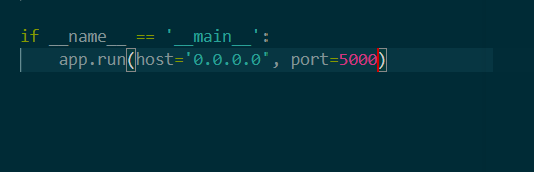

Although this improved the consistency of my configuration, it was not responsible for the Docker build failure.

The Dockerfile's `EXPOSE` instruction documents the intended container port; it does not automatically publish the port or require the application to use it.

## 7. Troubleshooting – Incorrect Working Directory

I discovered that I was running the Docker build command from the wrong directory.

Docker returned:

```text
failed to read dockerfile:
open Dockerfile: no such file or directory
```

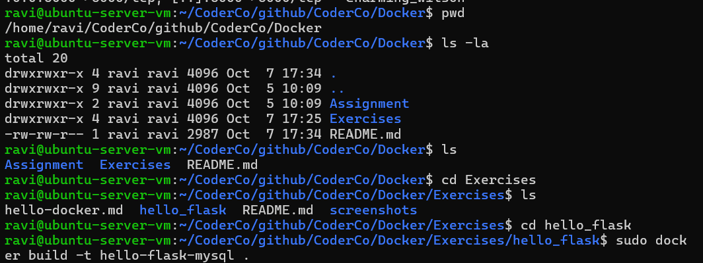

The command:

```bash
sudo docker build -t hello-flask-mysql .
```

uses `.` to specify the current directory as the Docker build context.

Because my Dockerfile was stored inside the `hello_flask` exercise directory, Docker could not locate it from the parent directory.

I navigated to the correct directory:

```bash
cd ~/CoderCo/github/CoderCo/Docker/Exercises/hello_flask
```

I then attempted to rebuild the image.

**Lesson learned:** Always verify the current working directory using `pwd` and `ls` when Docker cannot locate a Dockerfile.

## 8. Troubleshooting – mysqlclient Installation Failure

After resolving the working directory issue, Docker successfully located the Dockerfile but failed during the Python dependency installation.

The error was:

```text
ERROR: failed to build:
process "/bin/sh -c pip install flask mysqlclient"
did not complete successfully: exit code: 1
```

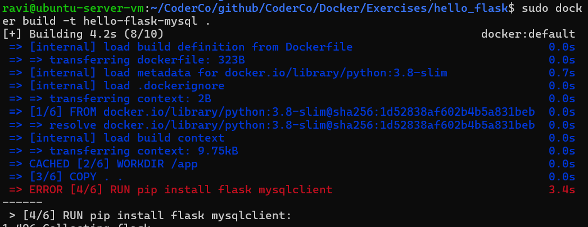

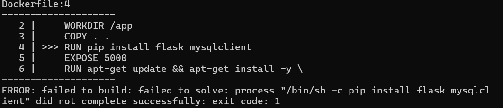

Further inspection of the build output revealed:

```text
/bin/sh: 1: pkg-config: not found

Exception: Can not find valid pkg-config name.
```

This indicated that `mysqlclient` could not locate the required system-level development libraries.

### Root Cause

My Dockerfile attempted to install `mysqlclient` before installing its required Linux dependencies.

I had also accidentally included the `pip install` instruction twice.

Docker executes Dockerfile instructions sequentially, so the build failed before reaching the dependency installation step.

### Resolution

I removed the duplicate installation command and reorganised the Dockerfile so that the system dependencies were installed first.

```dockerfile
FROM python:3.8-slim

WORKDIR /app

RUN apt-get update && apt-get install -y \
    gcc \
    python3-dev \
    libmariadb-dev \
    pkg-config \
    && rm -rf /var/lib/apt/lists/*

RUN pip install --no-cache-dir flask mysqlclient

COPY . .

EXPOSE 5000

CMD ["python", "app.py"]
```

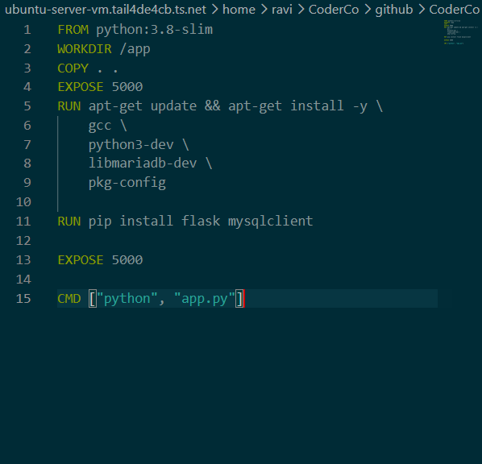

**Lesson learned:** Some Python packages require Linux development libraries and compilation tools. These dependencies must be installed before the Python packages that rely on them.

## 9. Successful Docker Image Build

After correcting the Dockerfile, I ran:

```bash
sudo docker build -t hello-flask-mysql .
```

This time, Docker completed the build successfully.

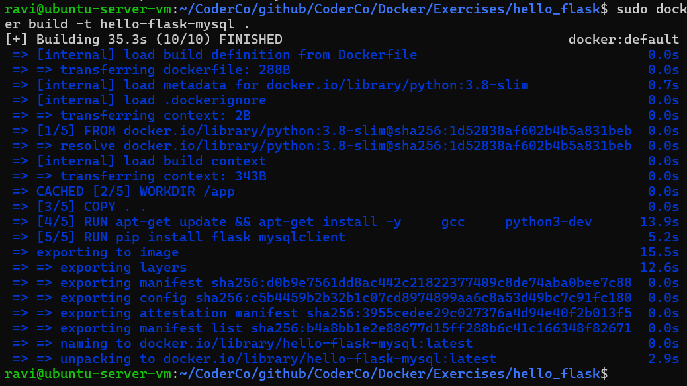

The successful build confirmed that the required dependencies were installed correctly and that Docker could create the Flask application image.

However, building the image successfully does not automatically confirm that Flask can communicate with MySQL. That requires running the updated container and testing the application.

## 10. Key Takeaways

This exercise helped reinforce several important Docker concepts:

1. **Docker networking:** User-defined networks allow containers to communicate using container names.
2. **Docker CLI syntax:** Options such as `--network` must be specified correctly.
3. **Working directories:** Docker builds depend on the build context and Dockerfile location.
4. **Dependency management:** Python packages may require additional Linux libraries.
5. **Dockerfile execution order:** Instructions execute sequentially, so dependencies must be installed in the correct order.
6. **Troubleshooting:** Reading detailed error output is more effective than repeatedly rebuilding without identifying the root cause.

## 11. Next Steps

The Docker image has been built successfully. My next steps are to:

- Run the updated Flask container on the custom Docker network.
- Verify that Flask can connect to the MySQL database.
- Confirm that the application displays the MySQL version.
- Explore Docker Compose to manage both containers together.
- Introduce Docker volumes to persist database data.

**Project status:** Docker image build completed. Flask-to-MySQL connectivity testing pending.

---

*Part of my CoderCo DevOps learning journey – Docker module.*