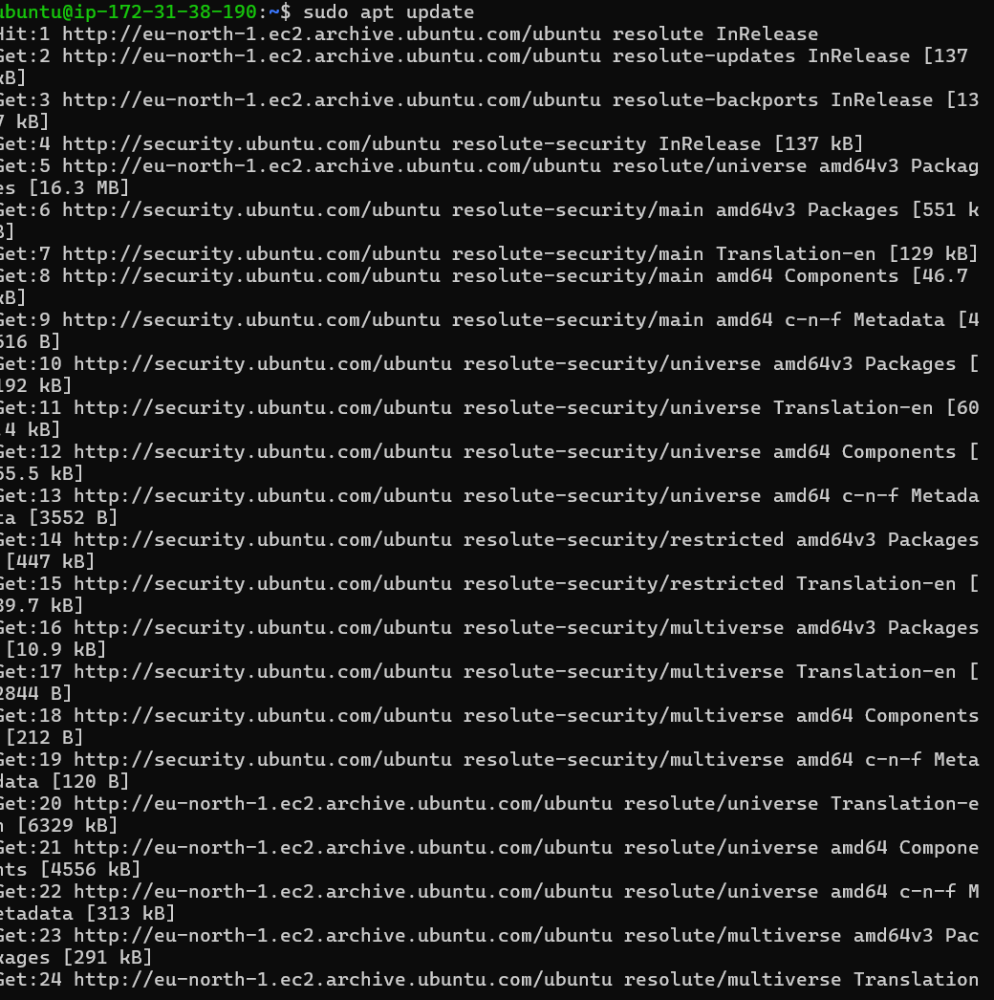
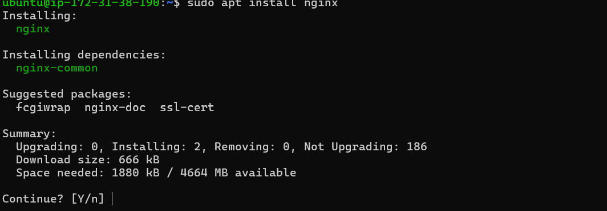
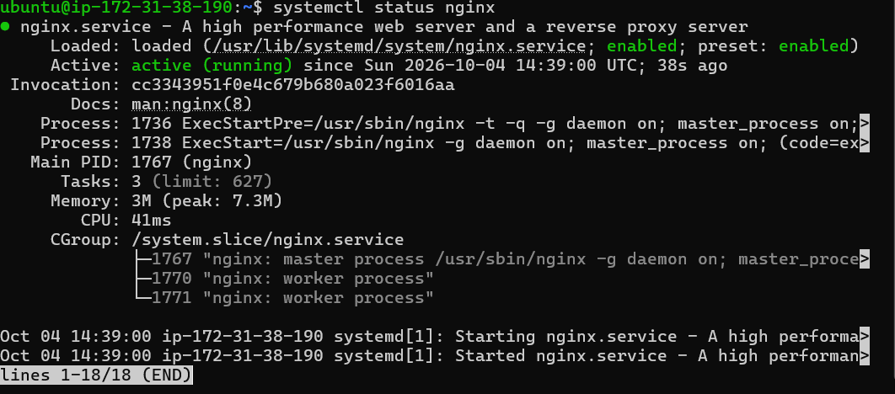
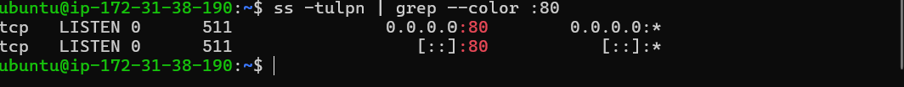
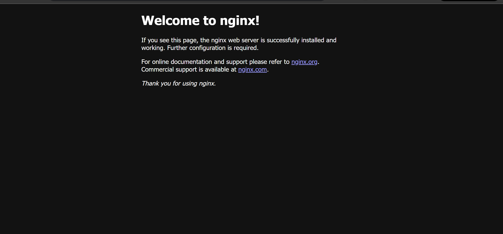
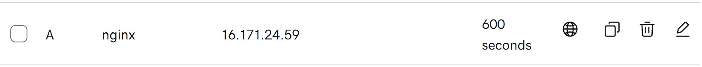
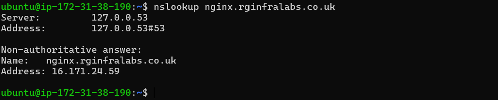
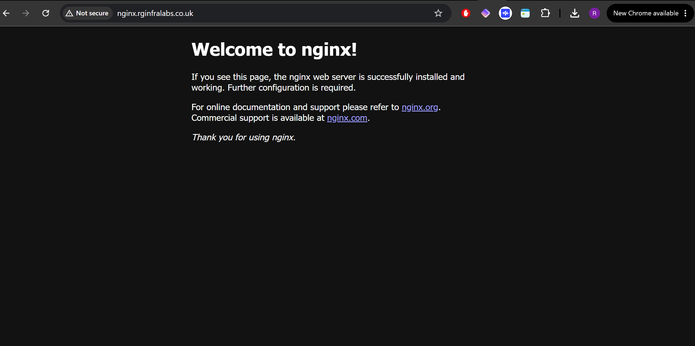
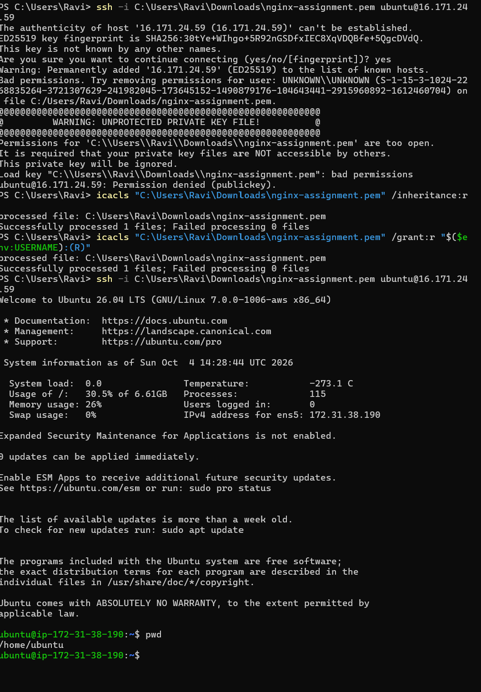

# AWS EC2 NGINX Web Server

## Project Overview

The objective of this assignment was to purchase a domain, deploy NGINX on an AWS EC2 instance, and make the NGINX web page accessible through a custom domain.

I built an NGINX web server hosted on an Ubuntu EC2 virtual machine in AWS. I then configured a custom domain purchased through GoDaddy to point to the public IP address of the EC2 instance, allowing the NGINX web server to be accessed using the domain name instead of the IP address.

This project gave me practical experience with AWS EC2, Linux, NGINX, DNS, SSH, security groups, and basic web server networking.

## Architecture

A simple representation of how HTTP traffic reaches the NGINX web server.

```text
Internet
   │
   ▼
nginx.rginfralabs.co.uk
   │
   │ DNS lookup
   ▼
GoDaddy DNS
   │
   │ A record
   ▼
AWS EC2 Public IPv4
   │
   │ HTTP (TCP/80)
   ▼
AWS Security Group
   │
   │ Allows inbound TCP/80
   ▼
Ubuntu EC2 Instance
   │
   ▼
NGINX Web Server

## What I Built

For this project, I deployed an NGINX web server on an Ubuntu EC2 instance in AWS and configured my custom domain to point to the server.

### 1. Deployed an Ubuntu EC2 Instance

I created an Ubuntu EC2 instance in AWS to host the NGINX web server.

The instance was configured with a security group that allowed:

- SSH (TCP port 22) from my public IP address.
- HTTP (TCP port 80) from `0.0.0.0/0` to allow the web server to be accessed over the Internet.

### 2. Installed NGINX

After connecting to the EC2 instance using SSH, I updated the package repository and installed NGINX.





I then checked the NGINX service to confirm that it was running successfully.



### 3. Verified NGINX Was Listening on Port 80

I used the `ss` command to confirm that the server was listening for HTTP connections on TCP port 80.

```bash
ss -tulpn | grep --color :80
```



### 4. Tested the Web Server Using the Public IP

Before configuring DNS, I accessed the EC2 instance using its public IPv4 address in a web browser.

The NGINX welcome page loaded successfully, confirming that the web server and AWS networking configuration were working.



### 5. Configured DNS

I created an A record with my domain provider, GoDaddy, to map the `nginx` subdomain to the public IPv4 address of the EC2 instance.

This created the following DNS mapping:

```text
nginx.rginfralabs.co.uk → EC2 Public IPv4 Address
```



I then used `nslookup` to verify that the domain resolved to the correct EC2 public IP address.

```bash
nslookup nginx.rginfralabs.co.uk
```



### 6. Verified the Custom Domain

Finally, I accessed the NGINX server using:

```text
http://nginx.rginfralabs.co.uk
```

The NGINX welcome page loaded successfully, confirming that the DNS record, AWS networking and NGINX web server were working together correctly.




## What I Learnt


- Difference between an EC2 private and public IPv4 address
- How AWS Security Groups control inbound traffic
- Why SSH should not be exposed unnecessarily to `0.0.0.0/0`
- How SSH key-pair authentication works
- How to verify a service with `systemctl`
- How to verify listening ports with `ss`
- How DNS A records map hostnames to IPv4 addresses
- How `nslookup` can be used to troubleshoot DNS
- Difference between HTTP/80 and HTTPS/443
- How the different pieces work together to make a web server publicly accessible


## Challenges and Troubleshooting

The main issue I encountered was SSH rejecting my EC2 private key because the `.pem` file permissions were too open on Windows. I researched the error and used `icacls` to remove inherited permissions and restrict access to my user account. After correcting the permissions, SSH successfully accepted the private key and connected to the EC2 instance. I also used `nslookup` to verify DNS resolution when troubleshooting access to the NGINX website.



## Result

successfully resolved to the EC2 instance and displayed the NGINX web server.


http://nginx.rginfralabs.co.uk


## Technologies Used
- AWS EC2
- Ubuntu Linux
- NGINX
- SSH
- AWS Security Groups
- DNS
- GoDaddy
- Git/GitHub