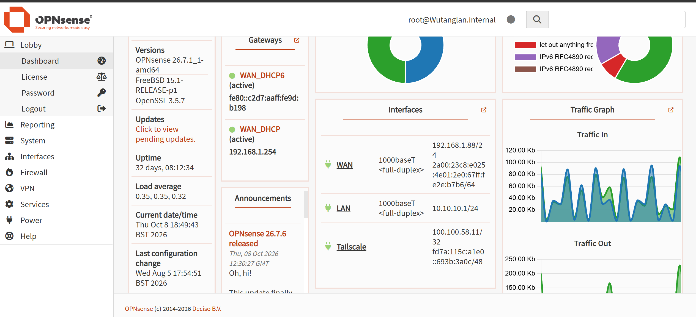
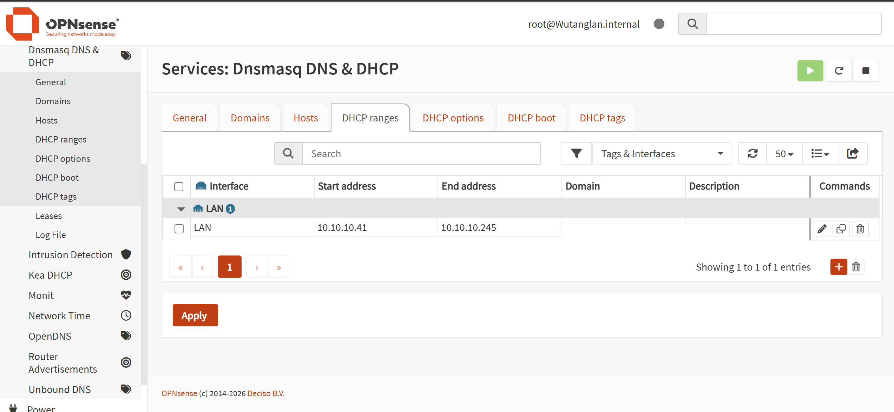
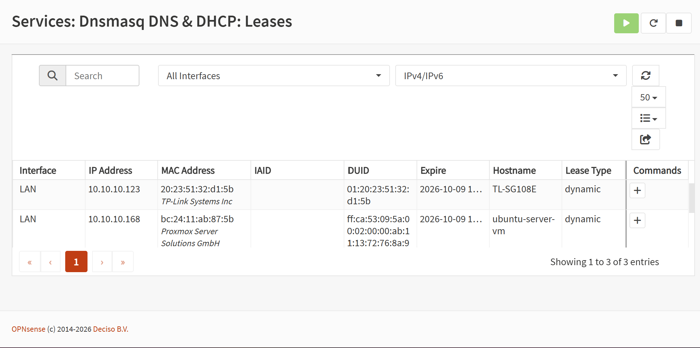
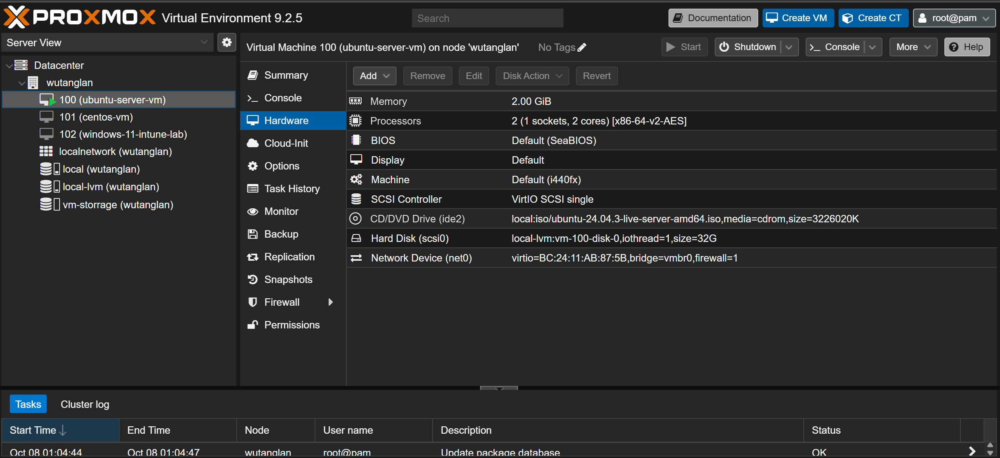
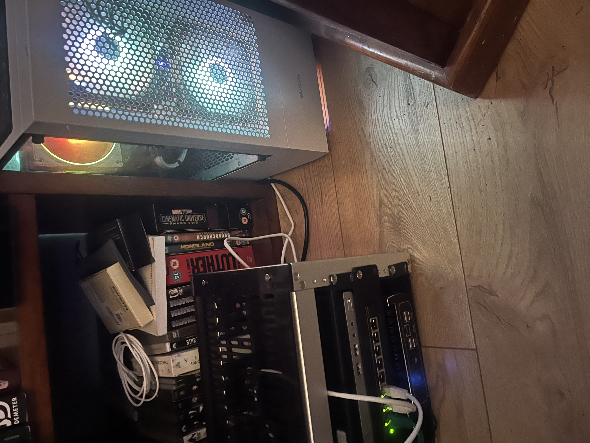
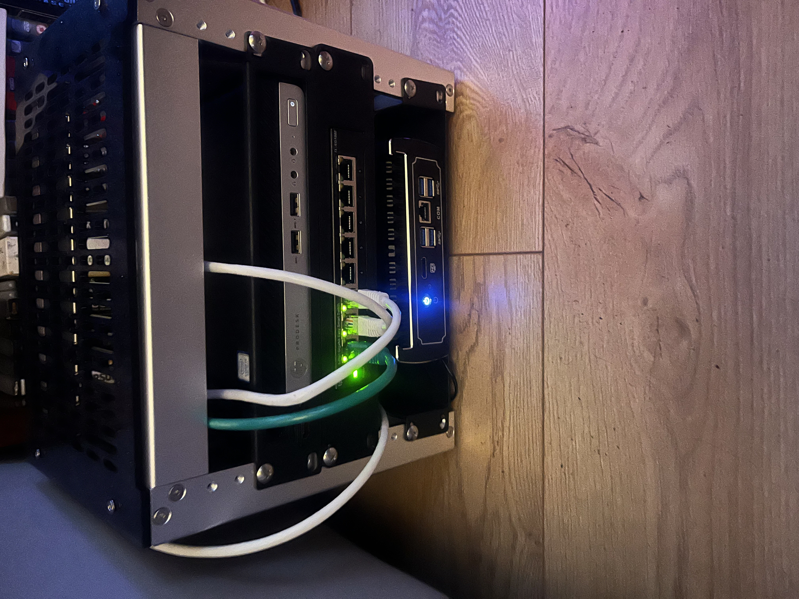

# DevOps Homelab — Networking & Infrastructure

## Overview

This project documents my personal homelab, built to develop practical skills in networking, Linux, virtualisation and DevOps.

The environment consists of a dedicated Protectli appliance running OPNsense, a TP-Link managed switch, a Proxmox virtualisation server and an HP ProDesk Mini running Ubuntu Server.

My goal is to use this infrastructure to practise deploying services, troubleshooting network issues and building end-to-end DevOps projects as I progress through the CoderCo bootcamp.

## 1. Hardware & Technologies

| Component | Purpose |
|---|---|
| Protectli Mini PC | Dedicated OPNsense router/firewall appliance |
| OPNsense | Network gateway, routing and DHCP |
| TP-Link TL-SG108E | Managed network switch |
| Proxmox VE | Virtualisation platform for Linux and Windows VMs |
| HP ProDesk Mini | Ubuntu Server for DevOps learning |
| Tailscale | Secure remote access to the homelab |

## 2. Network Architecture

I installed OPNsense directly onto my Protectli Mini PC using a bootable USB installer.

The Protectli is connected to my upstream router through its WAN interface, while the LAN interface connects to my managed TP-Link switch.

Physical devices and virtual machines connected to this LAN can obtain IP addresses through OPNsense and access the internet.

### Network Configuration

| Setting | Configuration |
|---|---|
| WAN IP | 192.168.1.88/24 |
| Upstream gateway | 192.168.1.254 |
| LAN IP / Gateway | 10.10.10.1/24 |
| LAN subnet | 10.10.10.0/24 |
| DHCP range | 10.10.10.41 – 10.10.10.245 |
| DHCP service | Dnsmasq |
| Remote access | Tailscale |

### OPNsense Dashboard

The dashboard shows the configured WAN, LAN and Tailscale interfaces.

The LAN interface uses `10.10.10.1/24`, providing the default gateway for devices on my homelab network.

## 3. DHCP Configuration

I configured the Dnsmasq DHCP service within OPNsense to automatically assign IPv4 addresses to devices connected to my LAN.

This removes the need to manually configure IP addresses on each device.

### DHCP Address Pool

The configured DHCP pool is:

- **Start address:** `10.10.10.41`
- **End address:** `10.10.10.245`
- **Subnet:** `255.255.255.0`
- **LAN gateway:** `10.10.10.1`

### DHCP Leases

The DHCP leases demonstrate successful address allocation to devices on the network.

Examples include:

| Device | Assigned IP | Lease type |
|---|---|---|
| TP-Link TL-SG108E | 10.10.10.123 | Dynamic |
| Ubuntu Server VM | 10.10.10.168 | Dynamic |

The Ubuntu Server VM is hosted on Proxmox, demonstrating how virtual machines can communicate with the physical network through a Linux bridge.

## 4. Proxmox Virtualisation

Proxmox VE is used to deploy and manage virtual machines within my homelab.

The environment allows me to create Linux and Windows VMs, experiment with operating systems and troubleshoot infrastructure without requiring separate physical hardware for every workload.

Virtual machines connected to the LAN through the appropriate Proxmox network bridge can receive DHCP addresses from OPNsense and access the internet.

### Proxmox Server

## 5. Dedicated DevOps Learning Server

My HP ProDesk Mini runs Ubuntu Server and is being repurposed as my primary DevOps learning environment, replacing my existing Ubuntu Server VM.

This will allow me to practise:

- Linux administration and Bash scripting
- Git and GitHub workflows
- Docker and Docker Compose
- Terraform and Infrastructure as Code
- Kubernetes
- CI/CD pipelines

The HP Mini will provide a dedicated environment for deploying, testing and troubleshooting projects throughout my CoderCo learning journey.

### Physical Homelab

## 6. Remote Access

I use Tailscale to access my homelab remotely through an encrypted private network.

This allows me to connect to supported devices and services without exposing SSH directly to the public internet.

For development, I use VS Code Remote-SSH to connect to Linux environments and work on projects remotely.

## 7. Future Improvements

As I continue developing my networking and DevOps skills, I plan to expand the environment with:

- Custom OPNsense firewall policies
- VLANs and network segmentation
- Additional network monitoring
- Docker and Docker Compose deployments
- Terraform infrastructure provisioning
- Kubernetes using K3s
- Automated CI/CD pipelines with GitHub Actions

These will be documented as separate projects or updates as they are implemented.

## 8. Learning Outcomes

Building and managing this homelab has helped me gain practical experience in:

- Installing OPNsense on dedicated hardware
- Understanding WAN and LAN networking
- Configuring DHCP services and address pools
- Understanding private IP addressing and default gateways
- Connecting physical infrastructure with virtual machines
- Using Proxmox for virtualisation
- Troubleshooting network connectivity
- Managing Linux infrastructure remotely

## Related Projects

[CoderCo Learning Repository](https://github.com/Wutang-Dev/CoderCo)

---

*This homelab is an ongoing learning environment. I will continue updating the documentation as I implement additional networking, cloud and DevOps technologies.*